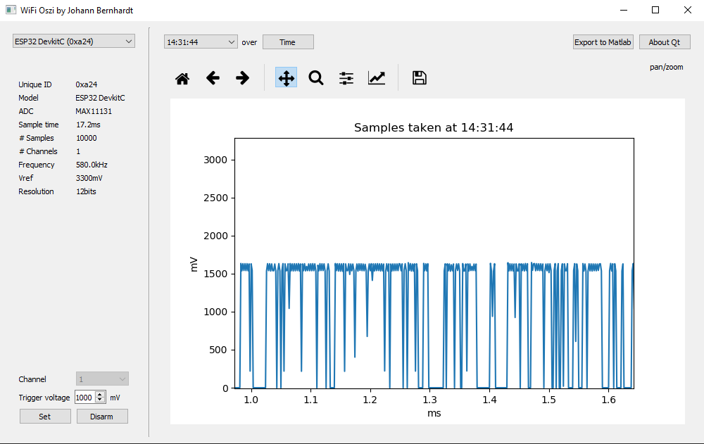

# OsziClient

### PROJECT

This repository provides the code for the PC Frontend of the WifiOszo PRoject. This project is intended to provide
basic oscilloscope access to unknown GND potentials without the risk of destroying a 20k gadget.

Any board will announce itself automatically to the application and will appear as possibility in the board selector
on the top left. The rest of the application will always referrence to the selected board. Any board will also announce
its capabilities which are listed in the board information right below the board selector.  
In the bottom left you can set a trigger for a specific channel and voltage. As soon as the trigger is hit the board
will fill its available RAM with measurements and, as soon as that is done, transmit those measurements to the
application. Incoming measurements will always be rendered as soon as they arrive. Technically it is possible for
transmissions to be corrupted (UDP) which will lead to the application not receiving any measurements. If a trigger
was hit and you don't get any measurements please try again. Should be a very rare case though.  
On the right hand side you can select all the measurement sets you received from the selected board. The data is
only deleted once the application is closed. So you can try multiple measurements and only export the one of interest.
I hope this gadget will save someone some time.

### HARDWARE SETUP

Skip this step for the Arduino MKR1000, since the integrated ADC is used.

The ESP32 board is the ESP32 DevkitC with an onboard WiFi antenna. Make sure you don't take a board with an external
antennal. Although it is fully compatible, it adds cables to manage and roughly doubles the cost since you need to pay
for an antenna as well.

Pins on the ESP32 are denoted with their GPIO number, which is usually printed on the board. Pins on the MAX11131BOB are
noted as *Connector*/*Descroption*.

Desolder the MAX14850ASE+ on the MAX11131BOB ([datasheet](https://datasheets.maximintegrated.com/en/ds/MAX11131BOB.pdf)).
It is designated as U3 and is a levelshifter to enable the ADC to interface with a 5V microcontroller. This levelshifter
is partially unidirectional and will use its floating input to write and overwrite any signal on the output side. The
ESP32 is not able to override it. When used with a 3.3V IOREF, the levelshifter introduces a delay and prohibits any use
of a SPI clock larger then 13MHz. And even that is far out of spec. To get ~600kHz you have to desolder it. If your
requirements are satisfied with a lower frequency you have to adjust the SPI frequency down until communication works.

Further, the ESP32 and especially its onboard WiFi introduce a lot(!) of noise on the 3.3V line. Since this line is
used as analog reference as well as power, i reccomend to provide a capacitor (or multiple) on H3/AREF+ and H3/GND on the
breakout board. A 10uF capacitor paired with a 100nF capacitor worked amazingly well in lab trials.

### Wiring table

| ESP32 | MAX11131BOB | Use |
|   --- |  ---------  |  --- |
|     - | H1/AIN3     | Default ADC input |
|   3.3V| H3/REF+     | Analog reference input |
|   3.3V| H3/VDD      | Power supply |
|   GND | H2/GND      | Ground |
|     5 | H3/CS       | SPI CS |
|    18 | H3/SCLK     | SPI SCLK | 
|    19 | H4/DOUT     | SPI MISO |
|    23 | H3/DIN      | SPI MOSI |

### SOFTWARE SETUP

The code in this repository was developed with PlatformIO and this segment will help you to set up the development
environment. How to set up PlatformIO is well documented online. Please do so and continue here.

- Clone this repository and open the repository as folder in PlatformIO.

- Unkomment the WiFi access parameters in *src/secrets.h* and adjust the values to your WiFi. In case you forget this step,
the build process will fail and tell you to do so.

- Connect an ESP32 or Arduino MKR1000 via USB to your computer.

- Check the file 'platformio.ini'. It contains src_build_flags. The flag -DSERIAL_DEBUG will set the SERIAL_DEBUG define
and force the Arduino MKR 1000 to wait for a serial connection before it can finish up initialization. If this flag is not
set: every serial debug call is removed and the serial interface is not initialized. If you are looking to measure something
you should remove this flag!

- Start the upload process. PlatformIO will choose the correct configuration automatically.

### MEASUREMENT SETUP

Setup a WiFi hotspot with the access parameters you provided to the microcontroller.

Connect the microcontroller to 3.3V, GND and sensor line (default A3 on Arduino MKR1000 and AIN3 on ESP+MAX11131).

Fire up everything and wait for the microcontroller to show up in the GUI.

### KNOWN ISSUES

**ESP32/MAX11131BOB** - There is still something which will stop execution on CORE1 ever so briefly and result in a skip
of ~10 measurements. This happens roughly once per 10k measurements/once per plot. It is highly unlikely for this interrupt
to meaningfully distort any measurements, but when in doublt measure again. I guess there is still some RTOS or WiFi
functionality left on CORE1.

**BOTH** - Multi Channel Mode is mostly implemented, but not finished and also not tested. It will not run without some debugging.